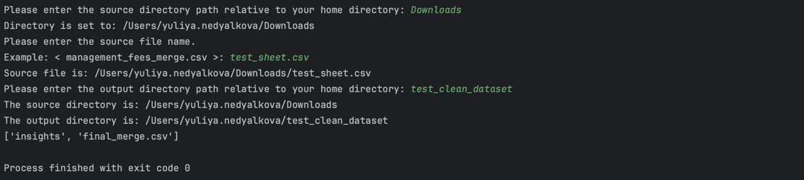

# dataset-management utility

## Description
The utility is written in Python, using Pandas package. It's purpose it to clean and manipulate data
and was created for a real life example of dataset from finance sector. 
It follows the convention of the "Data Science" pipeline, where the data is loaded, cleaned, transformed and then prepared for analysis.
The input file should follow the following columns structure:


But it can be easily modified to fit any other dataset.

## How to use it. 
Clone the current repository.
```bash
git@github.com:meta-morpho-sys/dataset-management.git
```

Run it in a Python environment. 
```bash 
python3 main.py
```
and follow the instructions that should appear on your screen.
1. Provide the name of the folder where your source file lives (source directory). You must provide a path relative to your home directory.
2. Provide the name of the source file. It must be a csv file.
3. Provide a name for the output directory. It can be any name. You must provide a path relative to your home directory.
4. Here is an example of what the prompt is like:
image.png
5. Navigate to your output folder. You should see `final_merge.csv`  which is the complete merge of all dups. Also, you will find an `insights/` directory where you can inspect some anomalies found while processing the Source File. 